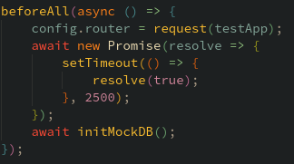
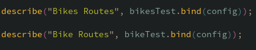
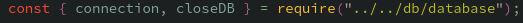

# bike-service-hub

Express.js REST API. Fully configured code style with Prettier, ESlint and editorconfig. Entire CI/CD pipeline with pre-commit and pre-push hooks + github action to create a Docker image and deploy it in a server

[](https://app.getpostman.com/run-collection/20110670-ad4b05cc-465e-4d22-a420-c0c79419fc34?action=collection%2Ffork&collection-url=entityId%3D20110670-ad4b05cc-465e-4d22-a420-c0c79419fc34%26entityType%3Dcollection%26workspaceId%3D4eabad42-d835-4b53-9df6-73f1c36b88ee)

---

## Project Information

This is a bike aggregator that lets you manage bike, bike rentals and all the process of renting a bike.
The main focus was to practive TDD and CI/CD best practices, as well as utilizing all the utilities that ES6 provides.
Javascript's classes where optional, so I opted to go the ES5 way.

---

## ES6 snippets

Here we can see an example of arrow function. In this example there is nothing special to it that makes it different from a normal functions.  


Here we have a clear example of an async promise. In this code we can clearly see how promises work. In an async function we can wait for a promis to resolve. In this case this case we wait for a timeout of 2.5s  


In these tests we use bind to "bind" the configuration to the test function. The test function will have all the config params in it's _this_ object.  


In the DB connection we use an object with a reference to the DB object. This is because we do not wait for the DB to be connected. Instead, when we call the initDB function the DB is loaded in the connection object and it's available in all the app. So we instanciate the DB only once.  


Here we can see an example of destructuring, importing only the connection and closeDB object of the export of the database.js file.  


Here we can see a middleware example. In this middleware we bind an object to _simulate_ parameters, since we cannot pass parameters directly. The middleware will have access to the strict _parameter_ in it's this object.  


Here we can see an understanding of object reference. If you use the mongodb driver to insert an object, the driver will modify the object with the _\_id_ key, and since it's a reference, your local object will change as well. To have an object created and not have it changed by the mongodb driver, I stringify the imported object and parse it when I need it, creating a copy for the mongo driver, and one for me.  


In the test configs I used Object.create to assign the same basic configuration (the router) as the prototype of all the different, more specific configs.  


Here we have an example usage of the _spread_ operator. I create an object called bike_id with the bike_id property of the body, and then the other properties are assigned to the info object.  


---

## Configuration

Configure the project with a .env

```
DBUSER=dbuser
PASSWORD=password
DBNAME=dbname
```

Then install the dependencies and start the project:

```sh
$ npm i
$ npm run dev
```

To push to the main branch, you need to pass the tests locally.
Then once you pushed to main, the CI pipeline will execute and push an updated image to DockerHub with the :latest and :x tag where x is the unique number of the execution.
